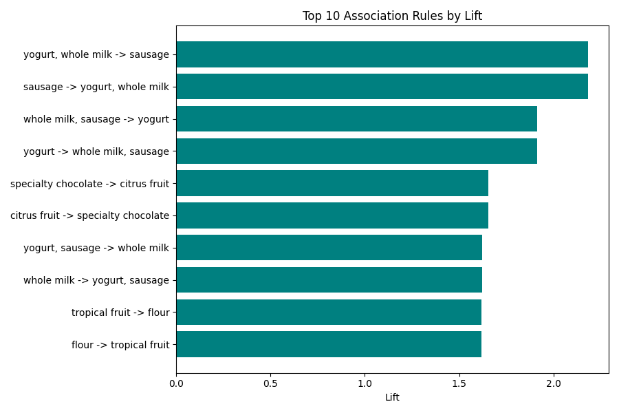

# Market Basket Analysis

## 📌 Project Overview
This project uses **Association Rule Mining (Apriori Algorithm)** to discover which grocery items are frequently purchased together. These insights can help retailers with product placement, cross-selling, and combo offers — similar to Amazon's "customers who bought this also bought" feature.

## 📊 Dataset
- **Source:** [Kaggle - Groceries Dataset](https://www.kaggle.com/datasets/heeraldedhia/groceries-dataset) by heeraldedhia
- **Columns:** `Member_number`, `Date`, `itemDescription`
- Each unique `Member_number` + `Date` combination is treated as one shopping transaction (basket)

## 🎯 Objectives
- Convert raw transaction logs into a basket format
- Apply the Apriori algorithm to find frequent itemsets
- Generate association rules using Support, Confidence, and Lift
- Visualize the strongest item relationships

## 🛠️ Technologies Used
- Python, Pandas
- Mlxtend (Apriori, Association Rules)
- Matplotlib

## 🔍 Project Workflow
```
Raw Transaction Data
      ↓
Group into Baskets (Member + Date)
      ↓
One-Hot Encoding (TransactionEncoder)
      ↓
Apriori Algorithm (Frequent Itemsets)
      ↓
Association Rules (Support, Confidence, Lift)
      ↓
Visualization
```

## 📈 Results

### Most Frequently Purchased Items
| Item | Support |
|---|---|
| Whole milk | 15.79% |
| Other vegetables | 12.21% |
| Rolls/buns | 11.00% |
| Soda | 9.71% |
| Yogurt | 8.59% |

### Top Association Rules (by Lift)
| Rule | Confidence | Lift |
|---|---|---|
| yogurt, whole milk → sausage | 13.17% | 2.18 |
| whole milk, sausage → yogurt | 16.42% | 1.91 |
| specialty chocolate → citrus fruit | 8.79% | 1.65 |
| yogurt, sausage → whole milk | 25.58% | 1.62 |
| tropical fruit → flour | 1.58% | 1.62 |



## 💡 Key Insights
- Customers who buy **yogurt and whole milk together** are over 2x more likely to also buy **sausage** than random chance.
- **Specialty chocolate and citrus fruit** show a notable cross-purchase pattern, suggesting a possible impulse-buy or snack-pairing behavior.
- Whole milk is the most frequently purchased single item, appearing in nearly 16% of all transactions — making it a strong anchor product for store placement strategy.

## 🚀 How to Run
```bash
pip install -r requirements.txt
python market_basket_analysis.ipynb
```
Make sure `Groceries_dataset.csv` is in the same folder as the script.

## 📁 Repo Structure
```
market-basket-analysis/
├── market_basket_analysis.ipynb
├── Groceries_dataset.csv
├── README.md
├── requirements.txt
├── association_rules.csv
└── top_rules_lift.png
```

---
*Built by [Adarsh](https://github.com/adarsh8158)*
